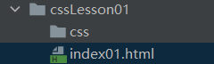
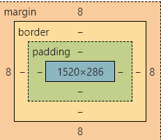
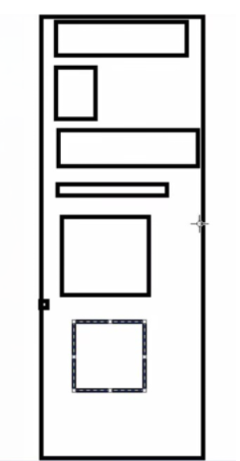
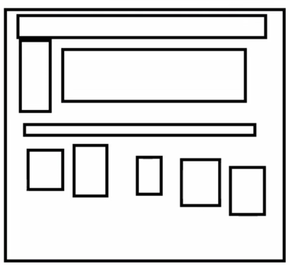

# 1、CSS和HTML

css要和html分离，有利于SEO



css里写样式，html写框架

# 2、css写法

优先级：就近原则，行内最大，style标签的内部样式和link标签的外部样式，谁在下面谁优先级高

#### 2.1、内部样式	

写在html中style标签里

```html
<!DOCTYPE html>
<html lang="en">
<head>
    <meta charset="UTF-8">
    <title>Title</title>
    <!--规范，<style>，css标签，编写css代码，写在head里
    语法:
        选择器{
            声明1;
            声明2;
            声明3;
        }
        每个声明要用分号(;)结尾
    -->
    <style>
        h1{

        }
    </style>
</head>
<body>
<h1>大标题</h1>

</body>
</html>
```

#### 2.2、外部样式

写在css文件夹中创建一个style.css直接写，建议写

```css
h1{
    color: red;
}
```

html进行链接 <link rel="stylesheet" href="路径">

```html
<!DOCTYPE html>
<html lang="en">
<head>
    <meta charset="UTF-8">
    <title>Title</title>
    <link rel="stylesheet" href="css/style.css">
</head>
<body>
<h1>大标题</h1>

</body>
</html>
```

拓展：外部样式还有一种写法

导入式

```html
<style>
    @import "css/style.css";
    @import url("css/style.css");
</style>
```

#### 2.3、行内样式

也可以直接在标签中写。

```html
<h1 style="color: red">标题</h1>
```

#### 2.4注释

```html
<style>
    /*   */
</style>
```

# 3、选择器

**作用：选择页面上的某一个或某一类元素**

## 3.1、基本选择器

**优先级：id选择器	>	class选择器	>	标签选择器**

**1、标签选择器**

```html
<!DOCTYPE html>
<html lang="en">
<head>
    <meta charset="UTF-8">
    <title>Title</title>
    <style>
        /*标签选择器:会选择页面上所有这个标签的元素*/
        h1{
            color: #121381;
        }
        p{
            font-size: 50px;
        }

    </style>
</head>
<body>

<h1>haha</h1>
<h1>xixi</h1>
<p>我要努力</p>

</body>
</html>
```

**2、类选择器**

```html
<!DOCTYPE html>
<html lang="en">
<head>
    <meta charset="UTF-8">
    <title>Title</title>

    <style>
        /*类选择器:
        *格式: .class的名称{}
        *好处，可以多个不同呢或相同的标签归类，同一个class，样式可以同时修改。
        *类名不可以是数字
        */
        .haha{
            color: red;
        }
        .xixi{
            color: tomato;
        }
    </style>
</head>
<body>

<h1 class="haha">haha</h1>
<h1 class="xixi">xixi</h1>
<h1 class="haha">lolo</h1>
<p class="haha">lolo</p>

</body>
</html>
```

**3、id选择器**

```html
<!DOCTYPE html>
<html lang="en">
<head>
    <meta charset="UTF-8">
    <title>Title</title>
    <style>
        /*id选择器:
        *格式: #id名称{}
        *标签id要保证全局唯一，才能精准定位到标签，更改格式。
        */
        #a1{
          color: red;
        }
        .style2{
            color: chocolate;
        }
        h1{
            color: #121381;
        }
    </style>
</head>
<body>
<h1 id="a1" class="style2">标题1</h1>
<h1 class="style2">标题2</h1>
<h1 class="style2">标题3</h1>
<h1 id="4">标题4</h1>
<h1 id="5">标题5</h1>


</body>
</html>
```

## 3.2、层次选择器

**1、后代选择器：在某个标签里面所有标签，多代(多层)。**

```html
<!DOCTYPE html>
<html lang="en">
<head>
    <meta charset="UTF-8">
    <title>Title</title>

    <style>
        /*后代选择器标签
        *格式: 祖先标签+空格+后代
        */
        /*body后所有p标签*/
        body p{
            background: red;
        }
    </style>
</head>
<body>
<p>p0</p>
<p class = "active">p1</p>
<p>p2</p>
<p>p3</p>
<ul>
    <li><p>p4</p></li>
    <li><p>p5</p></li>
    <li><p>p6</p></li>
</ul>
</body>
</html>
```

**2、子选择器：只有一代(一层)**

```css
/*子选择器:*/
body > p {
    background: green;
}
```

**3、兄弟选择器：其实是相邻弟选择器，选中当前标签下面第一个标签**

```css
/*相邻弟选择器
*格式：自己的class或id名+ ‘+’ + 兄弟标签名(任意)
*/
.active + p{
    background: blue;
}
```

**4、通用选择器：也叫通用兄弟选择器，选中当前标签下面所有兄弟标签**

```css
/*格式：自己的class或id名+ ‘~’ + 兄弟标签名(任意)*/
.active ~ p {
    background: tomato;
}
```

## 3.3、结构伪类选择器
伪类选择器，用于避免使用过多的class和id选择器，主要标志是有选择器中有冒号( : )

```html
<!DOCTYPE html>
<html lang="en">
<head>
    <meta charset="UTF-8">
    <title>Title</title>

    <style>
        /*伪类选择器，用于避免使用过多的class和id选择器*/
        /*
        *①选中ul中第一个孩子
        *ul li:first-child，指的是父元素ul中第一个li子元素
        */
        ul li:first-child{
            background: red;
        }

        /*②选中ul中最后一个孩子*/
        ul li:last-child{
            background: orange;
        }

        /*选中p1*/
        /*这里有两种写法
        *第一种：body p:first-child
        *这里主要介绍第二种：p:nth-child(1),括号中填几就是几。
        *第二种方法，会先找到p的父元素，再去找p的父元素第n个元素，不一定是p元素
        */
        p:nth-child(1){
            background: yellow;
        }
        
        /*
        *更准确的应该是
        *这个会先找到p的父元素，再去找p的父元素第n个p元素，这样只会指向p元素不会指向其他元素
        */
        p:nth-of-type(1){
            background: green;
        }
        
    </style>

</head>
<body>

<p>p1</p>
<p>p2</p>
<p>p3</p>
<ul>
    <li>li1</li>
    <li>li2</li>
    <li>li3</li>
</ul>

</body>
</html>
```

## 3.4、属性选择器（常用）

```html
<!DOCTYPE html>
<html lang="en">
<head>
    <meta charset="UTF-8">
    <title>Title</title>

    <style>
        .demo a {
            background: tomato;
            float: left;
            display: block;
            height: 50px;
            width: 50px;
            border-radius: 100%;
            text-align: center;
            color: black;
            text-decoration: none;
            margin-right: 5px;
            font: bold 20px/50px Arial;
        }

        /*属性选择器
        *格式:标签 + [] + {}
        *其中[]里填属性，或属性值，可以使用正则表达式
        */
        /*1、选中带id属性的元素*/
        a[id] {
            background: red;
        }

        /*2、选中id属性为first的元素*/
        a[id=first] {
            background: orange;
        }

        /*3、选中class中有link的元素,使用正则表达式
        *[属性^="要匹配的字符"]
        *[属性$="要匹配的字符"]
        *[属性*="要匹配的字符"]
        *这3种属性选择器是字符匹配，而非单词匹配。
        *尖角符号^，表示前匹配
        *美元符号$，表示后匹配
        *星号*，表示任意匹配
        *只有等于号表示要绝对等于
        */
        a[class*="link"] {
            background: yellow;
        }

        a[href^="images"] {
            background: green;
        }

        a[href$=".doc"]{
            background: blue;
        }

    </style>

</head>
<body>

<p class="demo">
    <a href="https://www.baidu.com" class="link first" id="first">1</a>
    <a href="../1.cssLesson01" class="link active" target="_blank" title="test">2</a>
    <a href="images/123.html" class="link item">3</a>
    <a href="images/123.png" class="link item">4</a>
    <a href="images/123.jpg" class="link item">5</a>
    <a href="abc" class="link item">6</a>
    <a href="/a.pdf" class="link item">7</a>
    <a href="/abc.pdf" class="link item">8</a>
    <a href="abc.doc" class="link item">9</a>
    <a href="abcd.doc" class="link last" id="last">10</a>
</p>

</body>
</html>
```

# 4、美化网页元素

span标签：重点要突出的字，使用span标签，块标签，占自己大小

div标签：，行标签，独自占一行

## 4.1、字体样式

```html
<!DOCTYPE html>
<html lang="en">
<head>
    <meta charset="UTF-8">
    <title>Title</title>

    <!--
        font-family：字体
        font-size：字体大小
        font-weight：字体粗细
        font-style：字体风格，如斜体(oblique)等
        color：字体颜色
    -->
    <style>
        body {
            /*font-family属性中可以写多个字体，用逗号隔开，前面的字体没有才会用后面的字体*/
            font-family: "Arial", 楷体;
            color: tomato;
        }

        h1 {
            font-size: 50px;
        }

        .p1 {
            font-weight: bold;
        }
        .p2{
            font-style: oblique;
        }
    </style>

</head>
<body>

<h1>剧情简介</h1>
<p class="p1">息兰一族被人灭族，受到举族保护的息山神女被封印为一颗兰草种子飘入尘世，万年后重生成天界低阶仙女小兰花，无意间复活了被困于昊天塔的月尊东方青苍。</p>
<p class="p2">因为小兰花无意间对其施加的同心咒，东方青苍不得不保护小兰花，在此过程中，早已断情绝爱的东方青苍却爱上了温顺可爱的小兰花 。</p>
<p>
    'We get old and get used to each other.We think alike.We read each others minds.We know what the other wants without asking.
    Sometimes we irritate each other a little bit.Maybe sometimes take each other for granted.
    But once in awhile, like today, I meditate on it and realise how lucky I am to share my life with the greatest woman
    I ever met.'
</p>
</body>
</html>
```

```css
<style>
    /*字体样式也可以写在一起，font: 字体风格 字体粗细 字体大小 字体格式*/
    p{
        font: oblique bolder 20px 楷体 ;
    }
</style>
```

## 4.2、文本样式

**1、颜色color**

RGB：#000000-#FFFFFF

RGBA：A指的是透明度，一般用于背景需要透明度时使用，eg：rgb(0, 255, 255, 0.5)

透明度还可以用opacity，常用

```css
opacity: 0.5;
```


**2、文本对齐方式**

```html
<!DOCTYPE html>
<html lang="en">
<head>
    <meta charset="UTF-8">
    <title>Title</title>

    <!--
	height：指的是标签高度
    text-align：设置块元素内文本的水平对齐方式，center(居中),left(靠左对齐),right(靠右对齐)
    text-indent：首行缩进，1px是1个像素大小，1em是1个字符大小
    line-height：调整行高，当行高等于标签高度字就可以上下了居中
    text-decoration：字体修饰线，
                     text-decoration: none——无修饰线
                     text-decoration: underline——下划线
                     text-decoration: line-through——中划线
                     text-decoration: overline——上划线

    -->
    <style>
        h1 {
            color: #121381; /*rgb*/
            text-align: center;
        }

        .p1 {
            color: rgba(0, 255, 255, 0.5); /*rgba*/
            text-indent: 2em;
        }
        .p3{
            background: tomato;
            height: 300px;/*这里高度是指标签高度，字体高度不变*/
            line-height: 300px;/*这里调的就是行高，当行高等于标签高度字就可以上下了居中*/
        }
        .ha{
            text-decoration: underline;/*下划线*/
        }
        .xi{
            text-decoration: line-through;/*中划线*/
        }
        .lo{
            text-decoration: overline;/*上划线*/
        }
    </style>

</head>
<body>
<p class="ha">123123</p>
<p class="xi">123123</p>
<p class="lo">123123</p>

<h1>剧情简介</h1>
<p class="p1">息兰一族被人灭族，受到举族保护的息山神女被封印为一颗兰草种子飘入尘世，万年后重生成天界低阶仙女小兰花，无意间复活了被困于昊天塔的月尊东方青苍。</p>
<p class="p2">因为小兰花无意间对其施加的同心咒，东方青苍不得不保护小兰花，在此过程中，早已断情绝爱的东方青苍却爱上了温顺可爱的小兰花 。</p>
<p class="p3">
    'We get old and get used to each other.We think alike.We read each others minds.We know what the other wants without
    asking.
    Sometimes we irritate each other a little bit.Maybe sometimes take each other for granted.
    But once in awhile, like today, I meditate on it and realise how lucky I am to share my life with the greatest woman
    I ever met.'
</p>

</body>
</html>
```


**3、首行缩进**

text-indent：首行缩进，1px是1个像素大小，1em是1个字符大小

**4、行高**

line-height：调整行高，当行高等于标签高度字就可以上下了居中

5、装饰，如下划线

text-decoration：字体修饰线，
                     text-decoration: none——无修饰线，经常由于超链接(a标签)去下划线。
                     text-decoration: underline——下划线
                     text-decoration: line-through——中划线
                     text-decoration: overline——上划线

6、水平对齐

```html
<!DOCTYPE html>
<html lang="en">
<head>
    <meta charset="UTF-8">
    <title>Title</title>
    <!--
        水平对齐,要有参照物,要有一个标签作为参照,故要有两个标签
    -->
    <style>
        img,span{
           vertical-align: middle;/*middle中间对齐*/
        }
    </style>
</head>
<body>

<p>
    
    <span>hahahahahahahahahahah</span>
</p>

</body>
</html>
```

## 4.3、超链接伪类

1、伪类是添加到选择器的关键字，用于指定所选元素的特殊状态。例如，伪类 :hover可以用于选择一个按钮，当用户的指针悬停在按钮上时，设置此按钮的样式。
**a:hover{ } —— 鼠标移上去**

a:active{ } —— 鼠标按住未释放
a:visited{ } —— 已访问的链接
a:link{ } —— 未访问的链接

```html
<!DOCTYPE html>
<html lang="en">
<head>
    <meta charset="UTF-8">
    <title>Title</title>
    <style>
        /*默认的颜色*/
        a{
            text-decoration: none;
            color: black;
        }
        /*鼠标移到超链接状态*/
        a:hover{
            color: tomato;
        }
        /*鼠标按住未释放状态*/
        a:active{
            color: green;
        }
        /*已访问的链接*/
        a:visited{
            color: orange;
        }
        /*未访问的链接*/
        a:link{
            color: purple;
        }
    </style>
</head>
<body>

<a href="#">
    
</a>
<p>
    <a href="https://www.baidu.com">蘑菇</a>
</p>
<p>
    <a href="">作者：超级马里奥</a>
</p>
<p>
    ￥10
</p>

</body>
</html>
```

## 4.4阴影

text-shadow:   ;

```css
/* x轴偏移 | y轴偏移 | 模糊半径 | 颜色 */
text-shadow: 1px 1px 2px black;
```

## 4.5、列表

*list-style:
*none 去掉列表前面的点
*circle 空心圆
*decimal 数字
*square 正方形

```html
<!DOCTYPE html>
<html lang="en">
<head>
    <meta charset="UTF-8">
    <title>Title</title>
    <link rel="stylesheet" href="css/style.css" type="text/css">
</head>
<body>
<div id="nav"><!--导航栏用nav标签，但更常用的是div标签，id设置为nav-->
    <h2 class="title">全部商品分类</h2>
    <ul>
        <li>
            <a href="#">图书</a>&nbsp;&nbsp;
            <a href="#">影像</a>&nbsp;&nbsp;
            <a href="#">数字商品</a>
        </li>
        <li>
            <a href="#">家用电器</a>&nbsp;&nbsp;
            <a href="#">影像手机</a>&nbsp;&nbsp;
            <a href="#">数码</a>
        </li>
        <li>
            <a href="#">电脑</a>&nbsp;&nbsp;
            <a href="#">办公</a>
        </li>
        <li>
            <a href="#">家居</a>&nbsp;&nbsp;
            <a href="#">家装</a>&nbsp;&nbsp;
            <a href="#">厨具</a>
        </li>
        <li>
            <a href="#">服饰鞋帽</a>&nbsp;&nbsp;
            <a href="#">个护化妆</a>
        </li>
        <li>
            <a href="#">礼品箱包</a>&nbsp;&nbsp;
            <a href="#">钟表</a>&nbsp;&nbsp;
            <a href="#">珠宝</a>
        </li>
        <li>
            <a href="#">食品饮料</a>&nbsp;&nbsp;
            <a href="#">保健食品</a>
        </li>
        <li>
            <a href="#">彩票</a>&nbsp;&nbsp;
            <a href="#">旅行</a>&nbsp;&nbsp;
            <a href="#">充值</a>&nbsp;&nbsp;
            <a href="#">票务</a>
        </li>
    </ul>
</div>
</body>
</html>
```

```css
#nav{
    width: 300px;
}
.title{
    font-size: 18px;
    font-weight: bold;
    text-indent: 1em;
    line-height: 30px;
    background: red;
}
/*
*list-style:
*none 去掉列表前面的点
*circle 空心圆
*decimal 数字
*square 正方形
*/
ul li{
    height: 30px;
    list-style: none;
    text-indent: 1em;
}
a{
    text-decoration: none;
    color: #000000;
    font-size: 14px;
}
a:hover{
    color: orange;
    text-decoration: underline;
}
```

## 4.6、背景

### 背景颜色

### 背景图片

集成方式写

```css
/*background: 颜色 图片 图片位置（相对标签的位置） 平铺方式*/
background: red url("../images/1.jpg") 200px 10px no-repeat;
```
分开写
```html
<!DOCTYPE html>
<html lang="en">
<head>
    <meta charset="UTF-8">
    <title>Title</title>

    <style>
        div{
            width: 1000px;
            height: 700px;
            border: 5px solid tomato;
            background-image: url("images/1.jpg");
            /*默认平铺，多张相同图片平铺，相当于background-repeat: repeat*/
        }
        .div1{
            background-repeat: repeat-x;/*图片在x轴平铺*/
        }
        .div2{
            background-repeat: repeat-y;/*图片在x轴平铺*/
        }
        .div3{
            background-repeat: no-repeat;/*不平铺*/
        }
    </style>
</head>
<body>

<div class="div1"></div>
<div class="div2"></div>
<div class="div3"></div>

</body>
</html>
```

## 4.7、渐变

```html
<!DOCTYPE html>
<html lang="en">
<head>
    <meta charset="UTF-8">
    <title>Title</title>
    <!--径向渐变，圆形渐变-->
    <style>
        body{
            /*background-color: #4158D0;*/
            background-image: -webkit-linear-gradient(166deg, #4158D0 0%, #C850C0 46%, #FFCC70 100%);
        }
    </style>
</head>
<body>

</body>
</html>
```

# 5、盒子模型

## 4.1、什么是盒子



margin：外边距，边框外面与其他标签距离

border：边框

padding：内边距，里面与边框的距离

元素有多大是margin + border + padding + 内容宽度

## 4.2、边框

1.边框样式

2.边框颜色

3.边框粗细

```css
/*border: 粗细 样式 颜色*/
border: 3px solid red;
/*
*solid：实线
*dashed:虚线
*/
border-left: 3px solid red;
border-right: 3px solid red;
border-top: 3px solid red;
border-bottom: 3px solid red;
```

4.圆角边框

一个框有四个角

```css
border-radius: 50px;/* 一个值所有*/
border-radius: 50px 20px;/*两个值上下 左右*/
border-radius: 10px 20px 30px 40px;/*左上 右上 右下 左下 顺时针方向*/
```

圆圈就是各个角都是100px，数值就是半径，也可用百分比

```css
border-radius: 50%;/*圆*/
border-radius: 50% 20%;/*两个值左上右下 右上左下*/
border-radius: 10% 20% 30% 40%;/*左上 右上 右下 左下 顺时针方向*/
```


## 4.3、外边距margin

```css
/*
    *margin: 1px 1px;集成只写两个值时，上下边距 左右边距
    *margin: 1px 1px 1px 1px;集成写四个值时上 左 下 右 顺时针顺序
    *margin-top: 1px; 上
    *margin-bottom: 1px;下
    *margin-left: 1px;左
    *margin-right: 1px;右
    */
```

妙用，居中，但必须要求是块元素，或者被块元素包裹，且块元素有固定的宽度

```html
<div></div>
<div>
    
</div>
```


```css
margin: 0 auto;上下外边距为0，左右自动居中
```


## 4.4、内边距padding

同外边距

```css
/*
    *padding: 1px 1px;集成只写两个值时，上下边距 左右边距
    *padding: 1px 1px 1px 1px;集成写四个值时上 左 下 右 顺时针顺序
    *padding-top: 1px; 上
    *padding-bottom: 1px;下
    *padding-left: 1px;左
    *padding-right: 1px;右
    */
```

## 4.5、盒子阴影

```css
box-shadow: 10px 10px 100px blue/*x轴 y轴 模糊半径 颜色 */
```

# 6、浮动

## 6.1、标准文档流



浮动就可以把合成一个网站



行内元素：只占本身大小，行内元素与块级元素不同，**不能设置宽高**。给行内元素添加浮动或display是inline-block or block之后，行内元素就相当于从行内元素,转换成了行内块元素。可以设置宽和高。

```html
span a img strong
```

块元素：独占一行

```html
h1~h6 p div li 列表
```

行内元素可以被包含在块元素中，反之不行

## 6.2、display

```html
<!DOCTYPE html>
<html lang="en">
<head>
    <meta charset="UTF-8">
    <title>Title</title>

    <!--display
    1.block 改成块元素
    2.inline 行内元素
    3.inline-block 是块元素，但是多个这种类型元素可以内联在一行
    4.none 不显示该元素
    -->
    <style>
        div{
            width: 100px;
            height: 100px;
            border: 1px solid red;
            display: inline;
        }
        span{
            width: 100px;
            height: 100px;
            border: 1px solid red;
            display: inline-block;
        }
    </style>
</head>
<body>

<div>div块元素</div>
<span>span行内元素</span>

</body>
</html>
```

1.这个也是实现行内元素排列的方式，但是我们很多情况都用float


## 6.3、float

1.左右浮动

```css
float:right;
float:left; 
/* 可以把浮动想象成飘起来了，浮动元素在上会飘到前面，未浮动元素在下被挤到后面，但浮动位置还是会留出来，全浮动时顺序就是html标签原来的顺序 */
```

给行内元素添加浮动之后，行内元素就相当于从行内元素,转换成了行内块元素。可以设置宽和高。

如果是块元素后面元素浮动，不会浮动到该块元素所在的行。

## 6.4、clear

clear，用于自己兄弟元素都浮动时，自己想要脱离浮动使用clear，让自己重新占据一行

对于CSS的清除浮动(clear)，一定要牢记：这个规则只能影响使用清除的元素本身，不能影响其他元素。

```css
/*
*clear: right;  右侧不允许有浮动元素
*clear: left;  左侧不允许有浮动元素
*clear: both;  两侧不允许有浮动元素
*clear: none;  可以浮动
*/
```


## 6.4、父级边框塌陷的问题

当元素浮动后，父级边框没有元素撑开，会变小

解决方案：

1、增加父级元素高度，看起来解决问题，高度要直接设置大一点

2、增加一个空的div标签，清除浮动

```html
<div id="father">
    <div class="layer01"></div>
    <div class="layer02"></div>
    <div class="layer03"></div>
    <div class="layer04">
        元素浮动可以向左和向右浮动，哈哈哈哈哈哈哈哈哈哈哈哈哈哈哈哈哈哈哈哈哈
    </div>
    <div class="layer05"></div>
</div>
```

layer01~04全浮动，05下面的样式

```css
div{
    margin: 10px;
    padding: 5px;
}
#father{
    border: 1px solid #000000;
}
.layer01{
    border: 1px dashed #ff0000;
    display: inline-block;
    float: left;
}
.layer02{
    border: 1px dashed #00f;
    display: inline-block;
    float: left;
}
.layer03{
    border: 1px dashed #060;
    display: inline-block;
    float: right;
}
.layer04{
    border: 1px dashed #666;
    font-size: 12px;
    line-height: 23px;
    display: inline-block;
    float: right;
}
.layer05{
    clear: both;
    margin: 0;
    padding: 0;
}

```

3、overflow

```css
overflow: hidden;/* 元素超出父元素大小溢出后，溢出部分隐藏 */
overflow: scroll;/* 元素超出父元素大小溢出后，会出现滚动条，溢出部分移动滚动条可以看到 */
overflow: auto; /* 元素超出父元素大小溢出后，会出现滚动条，溢出部分移动滚动条可以看到 */
```
把父元素样式设成  overflow: hidden;   也可解决问题
```css
div{
    margin: 10px;
    padding: 5px;
}
#father{
    border: 1px solid #000000;
    overflow: hidden;

}
.layer01{
    border: 1px dashed #ff0000;
    display: inline-block;
    float: left;
}
.layer02{
    border: 1px dashed #00f;
    display: inline-block;
    float: left;
}
.layer03{
    border: 1px dashed #060;
    display: inline-block;
    float: right;
}

.layer04{
    border: 1px dashed #666;
    font-size: 12px;
    line-height: 23px;
    display: inline-block;
    float: right;
}
```

4、父类添加一个伪类 after

```css
#father:after{
    content: "";/*添加一个空内容*/
    display: block;
    clear: both;
}
```

:after伪类选择器用于向被选中的HTML元素后面添加指定内容的行内元素，:after选择器经常与content 属性一起使用

**小结：**

1.浮动元素后面增加空div

   简单，但代码中尽量避免空div

2.设置父元素的高度

   简单，元素假设没有了固定的高度，就会被限制

3.overflow

   简单，下拉的一些场景避免使用

**4.父类添加一个伪类  :after(推荐)**

   写法稍微复杂，但没有副作用，推荐使用！

## 6.5、对比

- display

  方向不可以控制

- float

  浮动起来会脱离文档流，所以要解决父级边框塌陷问题

# 7、定位

## 7.1、相对定位

```css
#first{
    background: tomato;
    border: 1px dashed #0f0;
    position: relative;
    top: -20px;
}
```

相对定位：
    position:  relative;
    相对于自己原来位置进行偏移，他仍然在标准文档流中，原来的位置会被保留

```css
先写
position:  relative;
再写
top: 20px;  /* 意思是距离原来位置上面20px，相当于向下移，如果是负数-20px，相当于向上移 */
left: 20px;
bottom: 20px;
right: 20px;
```


## 7.2、绝对定位

基于XXX定位，也是上下左右

1、父级元素不存在相对定位或绝对定位时，基于浏览器边框定位会随滚动条移动

2、父级元素存在相对定位或绝对定位，子标签基于父元素定位，且只能在父级元素范围内移动

**绝对定位后，不在标准文档流中，原来的位置不会被保留**

position: absolute;

```css
position: absolute;
top: 20px;  /* 意思是距离原来位置上面20px，相当于向下移，一般只用正数，不用负数 */
left: 20px;
bottom: 20px;
right: 20px;
```

## 7.3、固定定位fixed

基于浏览器边框定位，但是会一直在那个位置，不会随滚动条移动改变位置

```css
position: fixed;
top: 20px;  /* 意思是距离原来位置上面20px，相当于向下移，一般只用正数，不用负数 */
left: 20px;
bottom: 20px;
right: 20px;
```

## 7.4、z-index

相当于有多层

层数为0~999

```css
.tipText{
    z-index: 999;
    color: white;
}
```

想要在最顶层就设置成999

最底层就设置成0

# 8.动画

菜鸟教程自行了解