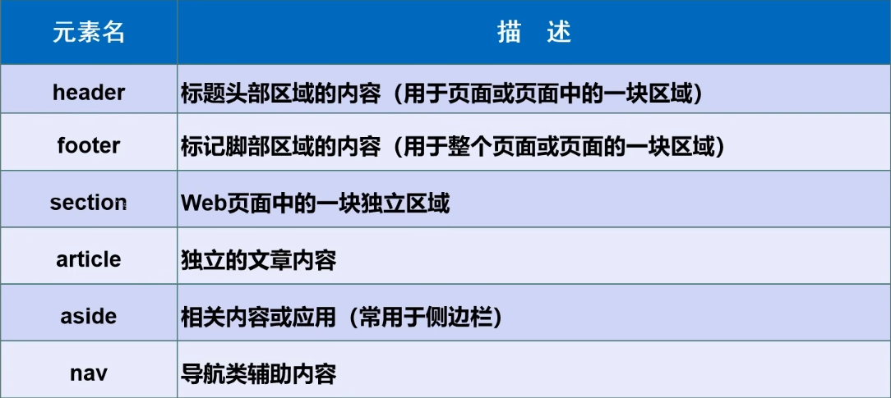
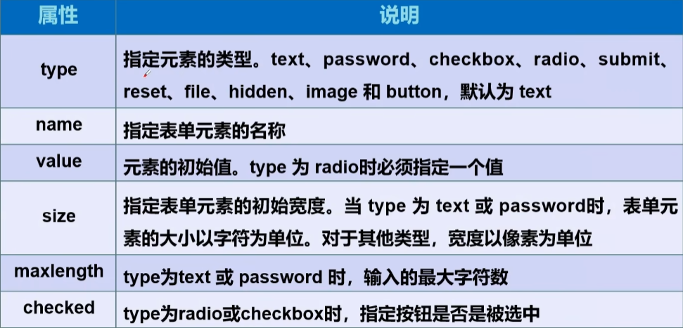

# 注释

```html
<!--	-->
```

# 主体

```html
<!DOCTYPE html>     <!--DOCTYPE:告诉浏览器，要用什么规范-->
<html lang="en"><!--告诉网页使用语言，一般en是英语，google打开网页出来时会弹出翻译-->
<head>          <!--head标签代表网页头部-->
    <meta charset="UTF-8"><!--meta描述性标签，用来描述我们网站的一些信息-->
                          <!--meta一般用来做SEO-->
    <meta name="keywords" content="茶杯狐,cupfox,电影资源,电影搜索,电影下载,在线观看,电影字幕,电视剧">
    <meta name="description" content="茶杯狐是中国最大的影视资源聚合搜索引擎，实时聚合全网优质影视资源，同时支持在线、下载和字幕。电影、电视剧、动漫、综艺应有尽有。">

    <title>Title</title><!--浏览器打开网页标签上的字-->
</head>
<body>  <!--body标签代表网页主体-->
</body>
</html>
```

# 基本标签

```html
<!DOCTYPE html>
<html lang="en">
<head>
    <meta charset="UTF-8">
    <title>Title</title>
</head>
<body>
<h1>一级标签</h1>
<h2>二级标签</h2>
<h3>三级标签</h3>
<p><!--段标签-->
    一只没有耳朵，
    一只没有尾巴，
    真奇怪！真奇怪！
</p>
一只没有耳朵，<br><!--换行标签，单标签无须闭合-->
一只没有尾巴，<br/><!--单标签一般写成这样规范-->

<hr><!--水平线标签-->
<hr/><!--单标签一般写成这样比较规范-->

<strong>粗体</strong>
<em>斜体</em>
<br/>
<!--符号,"&"开头,";"结尾-->
&nbsp;空格<br/>
&gt;大于号<br/>
&lt;小于号<br/>
&copy;版权符号<br/>
    
</body>
</html>
```

# 图像标签

```html

其中src和alt属性必须要有
src中写图片路径，src中路径可以选绝对地址和相对地址，一般使用相对地址。
alt写图片加载不出来时的文字
title写图片鼠标悬停时显示的文字
width宽，heigh高
```

# 链接标签

```html
<a href="path" target="">网页中显示的文本或图像</a>
href填超链接地址，url
target，点击链接后打开型窗口还是自己窗口跳转，常用_self自己窗口跳转、_blank新窗口跳转
<a href="../resources/image/1.jpg" target="_blank">网页中显示的文本或图像</a>
<a href="demo01.html" target="_blank">网页中显示的文本或图像</a>
<a href="www.baidu.com" target="_blank">网页中显示的文本或图像</a><!--点文字跳转图片-->
<a href="www.baidu.com" target="_blank"></a><!--嵌套一个图片标签，点图片跳转超链接-->
```

## 回到顶部

```html
<!DOCTYPE html>
<html lang="en">
<head>
    <meta charset="UTF-8">
    <title>Title</title>
</head>
<body>
<a name="top">顶部</a><!--锚标签-->
<p></p>
<p></p>
<p></p>
<p></p>
<p></p>
<p></p>
<p></p>
<p></p>
<p></p>
<p></p>
<p></p>
<p></p>
<p></p>
<p></p>
<p></p>
<p></p>
<p></p>
<!--通过超链接回到顶部
这个也叫锚链接
1.先要一个锚标记
2.跳转导标记
3.#后跟跳转的标记名
-->
<a href="#top">回到顶部</a>
<!--跳转到其他页面的锚标签-->
<a href="demo04.html#top">跳转</a>
</body>
</html>
```

## 功能标签

```html
<!--功能性链接
1.邮件链接：mailto
-->
<a href="mailto:1076650395@qq.com">邮箱联系</a>
```

# 块元素，行内元素

## 块元素

- 无论内容多少，该元素占一行
- p标签，h1~h6标签...
## 行内元素

- 内容撑开宽度，左右都是行内元素可以排在一行
- a标签，img标签...

# 列表

## 无序列表

```html
<ul>
    <li>java</li>
    <li>python</li>
    <li>c</li>
    <li>c++</li>
    <li>c#</li>
</ul>
```

## 有序列表

```html
<ol>
    <li>java</li>
    <li>python</li>
    <li>c</li>
    <li>c++</li>
    <li>c#</li>
</ol>
```

## 自定义列表

```html
<!--自定义列表
1.dl：自定义列表标签
2.dt：列表名
3.dd：列表内容
-->
<dl>
    <dt>语言</dt>

    <dd>java</dd>
    <dd>python</dd>
    <dd>c</dd>
    <dd>c#</dd>

    <dt>省份</dt>

    <dd>江西</dd>
    <dd>福建</dd>
    <dd>南京</dd>
    <dd>上海</dd>
</dl>
```

# 表格

```html
<!--表格table
    行   tr rows
    列   td
-->
<!--两行三列-->
<table border="1px">
    <tr>
        <!--colspan属性表示跨列，跨列就是几个单元格合并成一个-->
        <td colspan="4">1-1</td>
    </tr>
    <tr>
        <!--rowspan属性表示跨行，也是几个单元格合并成一个-->
        <td rowspan="2">2-1</td>
        <td>2-2</td>
        <td>2-3</td>
        <td>2-4</td>
    </tr>
    <tr>
        <td>3-1</td>
        <td>3-2</td>
        <td>3-3</td>
    </tr>
</table>
```

# 媒体元素

```html
<!--video视频
加controls,添加控制器
加autoplay自动播放
-->
<video src="../resources/video" controls autoplay></video>
<!--audio，音频
加controls添加控制器
加autoplay自动播放
-->
<audio src="../resources/audio" controls></audio>
```

# 页面布局



```html
</head>
<body>
<header>
    <h2>网页头部</h2>
</header>
<section>
    <h2>网页主题</h2>
</section>
<footer>
    <h2>网页脚部</h2>
</footer>

</body>
```

# iframe内联框架

```html
在页面中内嵌一个框架页面
<iframe src="https://www.baidu.com/" name="baidu" frameborder="1px"  width="1000px" height="400px"></iframe>

<a href="demo01.html" target="baidu">点击跳转</a>
这里target填上内联框架的name，则跳转的链接在框架中打开
```

# 表单

表单中元素尽量都带name属性

form标签：
	method,规定如何发送表单数据get/post
	get方式提交会在跳转页面的URL中显示输入名字和密码信息，不安全，高效
	post方式提交则不会显示输入信息，安全，且可进行大文件的传输
	action,表示向何处发送数据,可以是网站，也可以是请求处理地址
input标签：



```
checked,默认选中
readonly,只读
disabled,禁用
hidden,隐藏
```

所有input标签最好要都添加name。

```html
格式：form(表单)标签中嵌套多个input标签等
<form method="post" action="demo02.html"><!--method,规定如何发送表单数据get/post
                                 action,表示向何处发送数据,可以是网站，也可以是请求处理地址
                                 -->
    <!--input
        文本输入框: input type="text"
        value    默认初始值
        maxlength   最长能写几个字符
        size       文本框长度
		readonly		只读，不能输入
		placeholder		框底文字
		required        输入不能为空
		pattern         属性里填写正则表达式,规定输入内容格式
    -->
    <p>名字:
        <input type="text" name="username" value="name" maxlength="8" size="30"/>
    	<input type="text" name="name" placeholder="请输入用户名" required 
               pattern="[abc]"/>
    </p>
    <!--    密码框: <input type="password">    -->
    <p>密码:<input type="password" name="pwd" value="passwd"/></p>
    
    <!--单选框<input type="radio"/>
        单选:一定要添加name属性，填入相同的值，相当于放入同一分组，只选一个
        多选:不添加name属性，或则name属性填不同的值，但一般不用，有特殊的多选框
    	disabled，不能选中
	-->
    <p>性别:
        <input type="radio" value="boy" name="sex"/>男
        <input type="radio" value="girl" name="sex"/>女
    </p>
    <!--多选框
        同一组多选name属性填相同的值
        checked,默认选中
    -->
    <p>爱好:
        <input type="checkbox" value="sleep" name="hobby"/>睡觉
        <input type="checkbox" value="Program" name="hobby" checked/>敲代码
        <input type="checkbox" value="chat" name="hobby"/>聊天
        <input type="checkbox" value="game" name="hobby"/>游戏
    </p>
    <!--按钮:
        <input type="button"/>          普通按钮
         <input type="image" src="">    图片按钮
         <input type="submit"/>         提交按钮
         <input type="reset"/>          重置按钮
    -->
    <p>按钮:
        <input type="button" name="button" value="haha"/>
    <!--图片
        点击图片，可以跳转到form中action的页面
    -->
        <input type="image" src="../resources/image/1.jpg">
        <input type="submit"/>
        <input type="reset"/>
    </p>
    <!--文件域: <input type="file" name="file"> -->
    <p>
        <input type="file" name="file">
        <input type="submit" value="上传" name="upload"><!--value,更改按钮上的文字-->
    </p>
    <!--邮箱:     <input type="email"-->
    <p>email:
        <input type="email" name="email">
    </p>
    <!--URL:    <input type="url"-->
    <p>url:
        <input type="url" name="url">
    </p>
    <!--数字:     <input type="number"
    max:最大值
    min:最小值
    step:按一次加or减几
    -->
    <p>数字:
        <input type="number" name="num" max="100" min="0" step="10">
    </p>
    <!--滑块:     <input type="range"
    -->
    <p>滑块:
        <input type="range" name="range" max="100" min="0" step="2">
    </p>
    <!--搜索框:    -->
    <p>搜索:
        <input type="search" name="search">
    </p>

    <!--下拉框:
        selected属性是默认选中
        <select name="列表名称">
            <option value="China">中国</option>
         </select>
    -->
    <p>下拉框:
        <select name="列表名称">
            <option value="China">中国</option>
            <option value="US">美国</option>
            <option value="eth" selected>瑞士</option>
            <option value="yindu">印度</option>
            </select>
    </p>

    <!--文本域-->
    <p>反馈:
        <!--cols显示多少行
         rows显示多少列
          -->
        <textarea name="textarea" cols="30" rows="10"></textarea>
    </p>
</form>
```