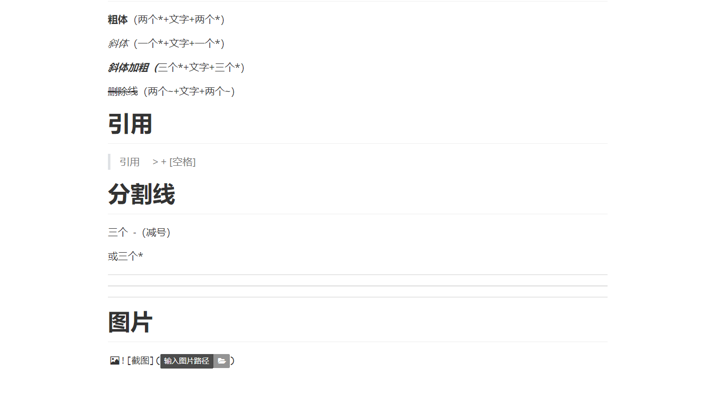

# MarkDown学习

# 标题

# 一级标题#+[空格]+标题

## 二级标题##+[空格]+标题

### 三级标题###+[空格]+标题

#### 四级标题####+[空格]+标题

# 字体

**粗体**（两个\*+文字+两个\*）

*斜体*（一个\*+文字+一个\*）

***斜体加粗（***三个\*+文字+三个\*）

~~删除线~~（两个~+文字+两个~）

# 引用

> 引用     > + [空格]

# 分割线

三个  -（减号）

或三个*

---

---

***

# 图片

> !+[图片名]+(图片路径)



# 超链接

> \[超链接名](url)\

[百度](www.baidu.com)

# 列表

> 有序列表1+ . +[空格]

1. A
2. B
3. C

> 无序列表 - +[空格]

- A
- B
- C

# 表格

名字|性别|生日
--|--| --|
张三|男|2023.1.1


# 代码块

> \```+语言（eg：java）

```java

```

`是键盘~下的符号不是顿号